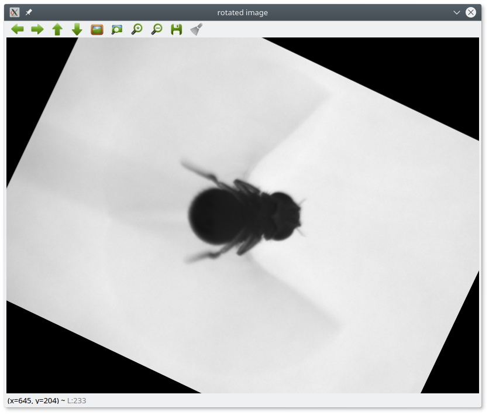

## find_fly_angle 

Finds the angle of the fly in a given (magno-tether) image.





## Installation

Requirements: python-numpy, python-opencv (>= 3.3), python-matplotlib (examples only)


```bash
$ python setup.py install 

```


## Running the example

Download the sample images from here [sample images](https://github.com/willdickson/find_fly_angle/releases/download/sample_images/sample_images.tar.gz)

Run the example passing the path to the sample image directory as an argument.

``` bash 

python run_example.py /path/to/sample_images

```


